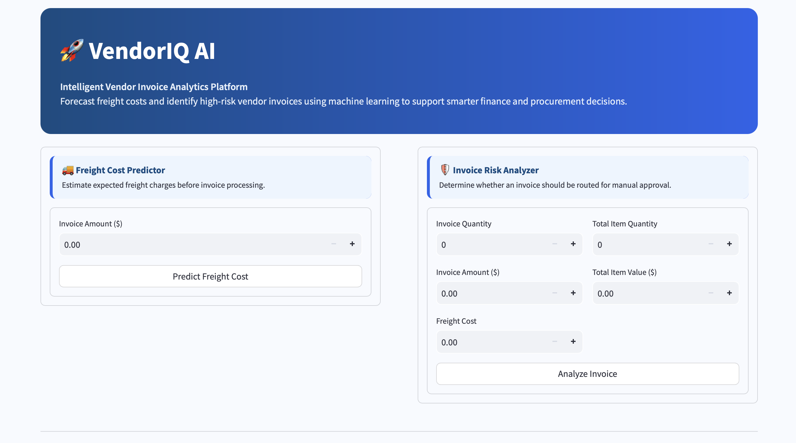
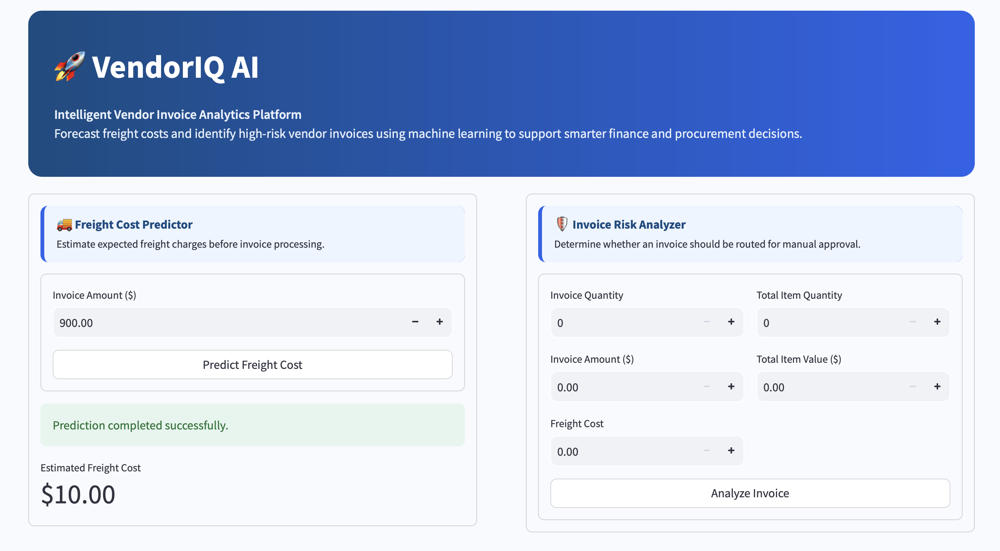
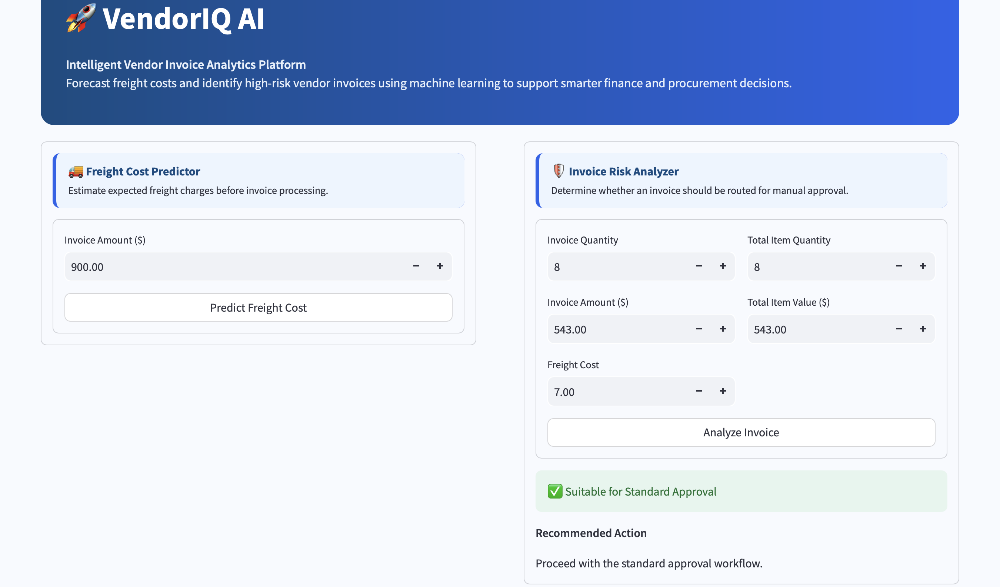
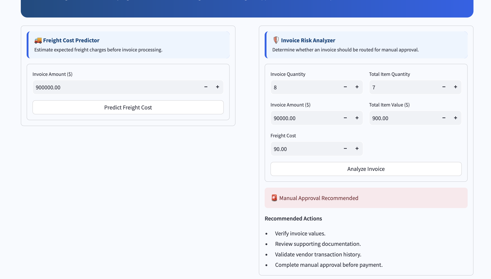

# 🚀 VendorIQ AI

## Intelligent Vendor Invoice Analytics Platform

VendorIQ AI is a machine learning-powered decision support application designed to assist finance and procurement teams in analyzing vendor invoices. The application predicts freight costs and identifies invoices that may require manual approval using historical procurement and invoice data.

The project demonstrates the complete machine learning workflow, including data preprocessing, feature engineering, model training, evaluation, model persistence using Joblib, and deployment through an interactive Streamlit interface.

---

## ✨ Features

- 🚚 Predict freight costs from invoice information.
- 🛡️ Identify invoices that require manual approval.
- 📊 Interactive web interface built with Streamlit.
- 💾 Trained machine learning models saved using Joblib.
- ⚡ Real-time predictions through a user-friendly dashboard.

---

## 📂 Project Structure

```text
VendorIQ_AI/
│
├── app.py                         # Streamlit application
├── README.md
├── requirements.txt
│
├── data/
│   └── inventory.db               # SQLite database
│
├── freight_cost_prediction/
│   ├── data_preprocessing.py
│   ├── modeling_evaluation.py
│   └── train.py
│
├── invoice_flagging/
│   ├── data_preprocessing.py
│   ├── modeling_evaluation.py
│   └── train.py
│
├── inference/
│   ├── predict_freight.py
│   └── predict_invoice_flag.py
│
├── models/
│   ├── predict_freight_model.pkl
│   ├── predict_flag_invoice.pkl
│   └── scaler.pkl
│
├── notebooks/
│   ├── Freight Cost Prediction.ipynb
│   └── Invoice Risk Classification.ipynb
├── images/
│   ├── dashboard.png
│   ├── freight_prediction.png
│   ├── invoice_standard_approval.png
│   └── invoice_manual_approval.png
│
└── report/
    └── VendorIQ_AI_Report.pdf
```

---
## 📁 Dataset

The original SQLite database used during development is not included in this repository because it exceeds GitHub's file size limit.

The trained machine learning models are included, allowing the application to run without retraining. Users who wish to retrain the models can replace the database by placing an `inventory.db` file inside the `data/` directory.

# 🧠 Machine Learning Models

## Freight Cost Prediction

The freight cost prediction module estimates expected freight charges from vendor invoice data.

**Models evaluated**

- Linear Regression
- Decision Tree Regressor
- Random Forest Regressor

**Selected Model:** Linear Regression (R² = **96.99%**)

---

## Invoice Risk Analysis

The invoice risk model predicts whether an invoice should proceed through the standard approval process or be routed for manual review.

**Models evaluated**

- Logistic Regression
- Decision Tree Classifier
- Random Forest Classifier

**Selected Model:** Random Forest Classifier (Accuracy = **91%**)

---

# 📸 Application Preview

### Dashboard



### Freight Cost Prediction



### Standard Approval



### Manual Approval



---

# ⚙ Technology Stack

- Python
- Pandas
- NumPy
- Scikit-learn
- SQLite
- Streamlit
- Joblib

---

# 🚀 Running the Project

```bash
gh repo clone Pratik-Billade/VendorIQ_AI

cd VendorIQ_AI

python3 -m venv .venv

source .venv/bin/activate

pip install -r requirements.txt

streamlit run app.py
```

---

# 👤 Author

**Pratik Billade**

GitHub: https://github.com/Pratik-Billade

LinkedIn: https://www.linkedin.com/in/pratikbillade
